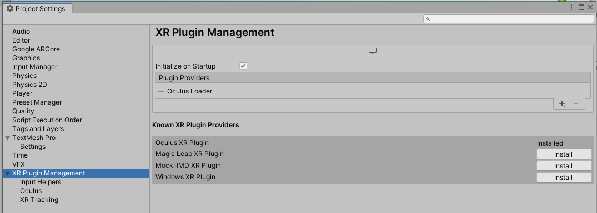
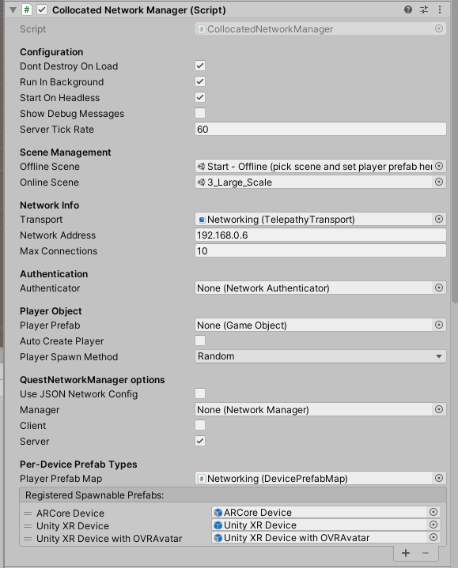

# Collocated MR Examples for VRST 2020
## This research received funding from the European Research Council (ERC) under the European Union's Horizon 2020 research and innovation programme #835197, ViAjeRo. See https://viajero-project.org/

This repository contains exemplars for creating co-located experiences across multiple Mixed Reality devices (e.g. smartphones, headsets) by manually aligning SLAM tracked coordinate spaces across these devices using either one-point or two-point alignment. For details on these approaches and their justifications, see the paper in the `Paper` dir first, as it explains the different exemplars and alignment techniques - this README concentrates on setup and installation. There are two components here:

1) [Collocated MR folder in Unity Assets] Exemplars for creating co-located MR experiences.

2) [SLAM Assessment folder in Unity Assets + R Workbooks] To explore the use of trilateration to benchmark the performance of different SLAM tracked devices in any arbitrary space. This one may lag behind the Master branch significantly, but is a snapshot of the processes we used for our paper.

## Pre-requisites
* Unity 2019.3.6f1 or higher (going earlier than 2019.3 will require adapting to the older XR device management)
* XR device compatible with the new (at time of writing) XR Plugin Management in Unity
* All the pre-requisites required for building for your XR device of choice. ARCore, generic XR, and Oculus Quest are supported in particular here.
* For Quest-specific examples, you'll need the Quest pre-reqs too e.g. Java, Android SDK, Oculus App for ovravatar.dll, developer mode enabled etc.) setup and working correctly. It also works over the Oculus Link for testing purposes. Oculus Quest(s) should be setup to use your roomscale space, either by drawing the boundaries as usual, or using developer options to disable the boundaries altogether if it's a huge/unmappable space (need to do this every time the device starts up as this doesn't save after you turn the Quest off).
* All devices (including server PC) need to be on the same wifi network. 

## Setup
1. Clone project, open in Unity, set Build Target as appropriate - for Oculus Quest and ARCore devices this will be Android
1. Set the XR management plugin as appropriate e.g. for Oculus Quest, add and enable the Oculus loader. For ARCore currently is no plugin, so remove any loaders and disable the XR management to fall back to the ARCore SDK support. 
1. Open the demo scene `QuestMultiplayerUnityProject\Assets\Research\Collocated MR\Start - Offline (pick scene and set player prefab here).unity` - this is the default scene for starting the Networking up.
 1. In the Scene Hierarchy, select the `Networking` object and configure...  
  1. Tick the Client/Server boxes as appropriate for deployment, and set the Network address to the server device.
  1. Register any Player prefabs for different device types (figure shows three currently, an ARCore device, a generic XR device, and an Oculus XR device such as a Quest) for clients, see the `DevicePrefabMap` component for details on how these are assigned. N.B. Some prefabs may not be cross-platform compatible e.g. the Oculus Avatar SDK won't work on non-Oculus devices, so you can't use that prefab if you want a shared experience across Oculus and ARCore devices for example.
  1. Select the Scene to load when connected - one of the numbered scenes in the `Scenes` folder, see the paper for details on these scenes.
  1. For later deployments once the app is installed, optionally connect the Oculus Quest or Android device to the PC and modify their networking.json files to configure network settings e.g. on the Quest, browse to `Internal shared storage\Android\data\com.DefaultCompany.QuestMultiplayerUnityProject\files\ExternalProjectFiles\config` and edit the networking.json file to change the server IP address used at startup there (if UseJSONNetworkConfig was enabled in `Networking' prior to build/deployment).

1. Build & Run / install the app to your device of choice, and start the app.
1. Start up a server instance (e.g. untick client, tick server, hit Play in Unity Editor)
1. Once connected, decide a position in your roomscale space that will be your calibration point(s), depending on the exemplar scene chosen. For each client, stand at that physical point, and either use the on-device UI or the XR controller buttons as instructed in the scene to perform an alignment. You should hear a spoken prompt informing you of the alignment being performed.

At this point, your clients should be aligned in VR as you are in reality (roughly), such that you can see each other's devices in the scene. 

## Some features
### Oculus Avatars
There is an XR player prefab specifically setup for Oculus Avatars, but this is for co-located Oculus devices only.

### Todo
* Retrieve calibrations for known spaces (e.g. using Oculus Quest boundary support)

